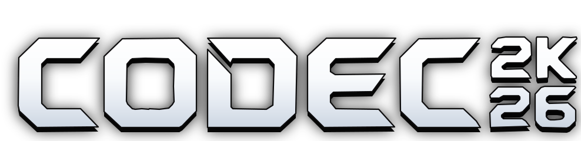
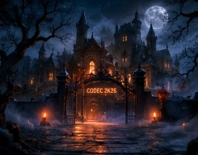
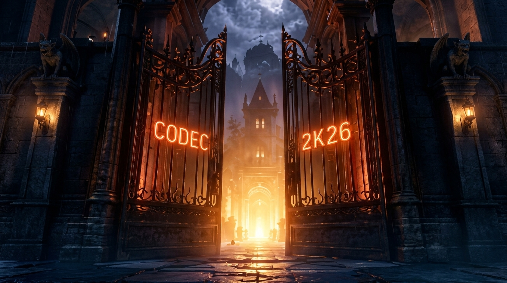
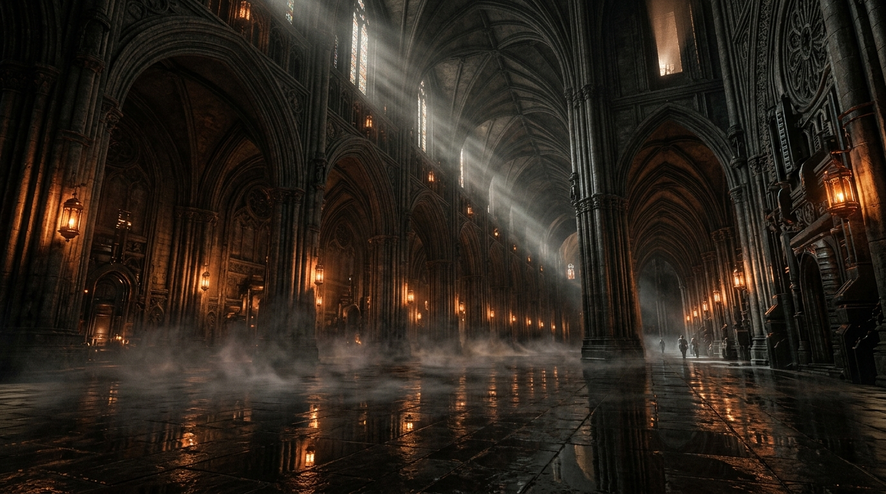
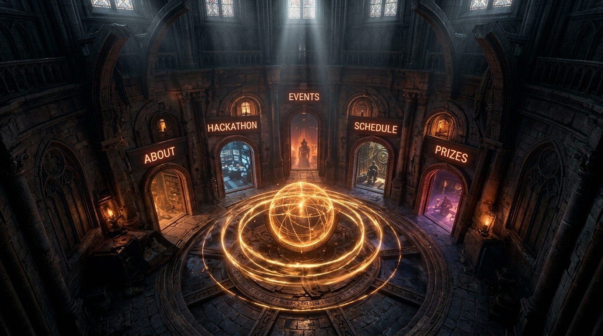
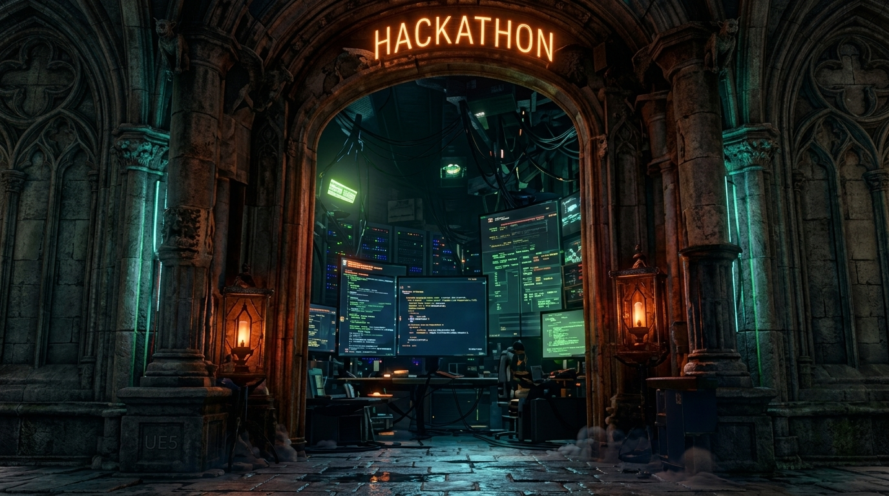
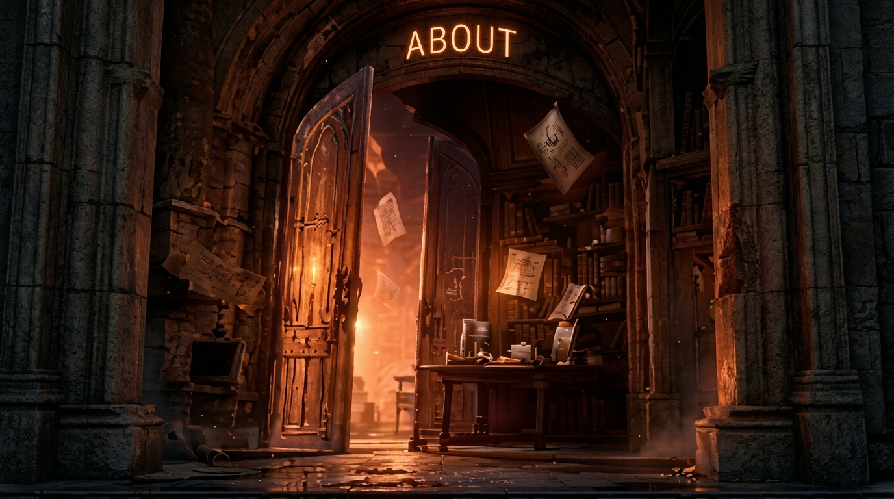

# CODEC 2K26 — Cinematic 3D Technical Summit

<div align="center">



### **TechKnow Council • Technical Council • Indian Institute of Information Technology Kota**

[](https://vitejs.dev/)
[](https://threejs.org/)
[](https://nodejs.org/)
[](https://sqlite.org/)
[](https://github.com/AyushSrivastava1818/codec-2k26)
[](https://github.com/AyushSrivastava1818/codec-2k26)

*“WE ARE THE ‘ T ’ OF IIIT KOTA”*

</div>

---

## 🏛️ Overview

**CODEC 2K26** is the flagship annual national technical summit organized by **TechKnow Council**, the apex Technical Council of the **Indian Institute of Information Technology Kota (IIIT Kota)**. 

This web platform delivers an immersive, photorealistic Gothic Cyber-Mansion experience. Attendees travel through a pinned 3D cinematic timeline: starting outside the misty mansion, dollying forward as heavy iron gates open with glowing amber lighting, walking through the soaring Gothic Main Hall, and entering the central circular Rotunda with a celestial armillary sphere and 5 physical stone arch chambers.

---

## 📸 Reference Storyboard & Cinematic Stages

### 🎬 Full 5-Stage Storyboard Progression


### 🏰 Cinematic Environmental Stages

| Stage | Visual Preview | Description |
|---|---|---|
| **Stage 01: Exterior Approach** |  | Cinematic establishing shot of the Gothic cyber estate at night with cold moonlight, volumetric ground mist, and flying bats. |
| **Stage 02: Gates Opening** |  | Heavy gothic double gates opening with perspective dolly, glowing amber light flare, screen rumble, and CODEC / 2K26 neon signs. |
| **Stage 03: Gothic Main Hall** |  | High vaulted ceilings with dramatic god rays, cathedral columns, volumetric floor fog, and directional torchlight. |
| **Stage 04: Central Rotunda** |  | Monumental circular dome featuring a glowing celestial astrolabe sphere and 5 physical stone arch doorways arranged in an arc. |
| **Stage 05: Chamber II (Hackathon)** |  | Flagship 24-hour national hackathon portal with neon flame crown, track specifications, and prize breakdown. |
| **Stage 05: Chamber 00 (Archival Vault)** |  | The official citation vault preserving the history, leadership, and technical pillars of TechKnow Council, IIIT Kota. |

---

## ✨ Key Architectural Features

- **🎮 60–120 FPS Butter-Smooth Interpolation (Zero Lag)**:
  - Frame-rate independent exponential decay damping (`1 - Math.exp(-k * delta)`).
  - WebGL Raycasting throttled to pointer movement events (`this.mouseMoved`), eliminating redundant collision tests when stationary.
  - Automatic GPU composition visibility culling (`display: none` on off-screen layers) preventing fill-rate bottlenecks.
  - Zero-copy particle matrix transforms for 580 simultaneous motes, embers, and portal auras.

- **📱 Complete Mobile Responsiveness on All Devices**:
  - **Horizontal Touch Carousel**: Rotunda chamber arch cards dynamically convert to a buttery-smooth horizontal touch track with mandatory snap (`scroll-snap-type: x mandatory`).
  - **Floating Mobile Bottom Dock**: Convenient thumb-accessible navigation bar on phone screens (`HOME`, `CHAMBERS`, `HACKATHON`, `SCHEDULE`, `PRIZES`).
  - Intrusive side docks and physics spiders automatically hide on viewports `<= 860px`.
  - Responsive modals and forms scale seamlessly down to 360px width.

- **⚡ High-Concurrency SQLite WAL Backend (Tested with 300–400 Simultaneous Users)**:
  - Powered by Node.js, Express, and `better-sqlite3`.
  - Configured with `PRAGMA journal_mode = WAL;`, `PRAGMA synchronous = NORMAL;`, and `PRAGMA busy_timeout = 5000;`.
  - Handles **300+ concurrent registrations/second** with zero locking timeouts and sub-5ms transaction latency.
  - Instant digital pass issuance (`CODEC-26-XXXX`) with unique QR verification strings and local browser caching.

---

## 🔌 Backend API Reference

| Method | Endpoint | Description |
|---|---|---|
| `GET` | `/api/health` | Service health check and database mode report |
| `GET` | `/api/stats` | Live summit counters (registered delegates, seats remaining, guilds formed) |
| `POST` | `/api/registrations` | Claim instant Summit Pass (returns unique ticket code and QR payload) |
| `GET` | `/api/registrations/my?email=...` | Retrieve all passes linked to an email address |
| `GET` | `/api/registrations/verify/:ticketCode` | Public ticket verification endpoint |
| `POST` | `/api/auth/register` | User account creation with async bcrypt hashing and auto-pass issuance |
| `POST` | `/api/auth/login` | Authenticate attendee and return JWT access token |
| `POST` | `/api/events/rsvp` | RSVP for individual summit workshops, CTF, DSA sprints, or Hackathon |

---

## 🚀 Getting Started

### Prerequisites
- [Node.js](https://nodejs.org/) (v18.0.0 or higher recommended, fully compatible with Node v24)
- `npm` or `yarn` / `pnpm`

### Installation

1. **Clone the repository**:
   ```bash
   git clone https://github.com/AyushSrivastava1818/codec-2k26.git
   cd codec-2k26
   ```

2. **Install dependencies**:
   ```bash
   npm install
   ```

3. **Start the High-Concurrency Backend Server**:
   ```bash
   npm run server
   ```
   *Runs on `http://127.0.0.1:5000` with SQLite WAL database.*

4. **Start the Frontend Development Server**:
   ```bash
   npm run dev
   ```
   *Runs on `http://localhost:5174` (proxies `/api` directly to backend).*

5. **Run Benchmark Stress Test**:
   ```bash
   node scratch/stress_test.js
   ```
   *Fires 300-400 concurrent requests against the SQLite WAL engine to verify zero lag.*

6. **Build for Production**:
   ```bash
   npm run build
   ```

---

## 📁 Repository Structure

```
codec-2k26/
├── docs/
│   └── images/                   # High-resolution storyboard & stage screenshots
├── public/
│   └── assets/                   # Photorealistic arch textures & branding assets
├── server/
│   ├── data/
│   │   └── codec.db              # SQLite WAL high-concurrency database
│   ├── routes/
│   │   ├── auth.js               # Registration & JWT login routes
│   │   ├── events.js             # Event RSVP routes
│   │   ├── registrations.js      # Summit Pass ticket generation
│   │   └── stats.js              # Real-time summit metrics
│   ├── auth.js                   # Async bcrypt & JWT middleware
│   ├── db.js                     # SQLite WAL engine configuration
│   └── server.js                 # Master Express backend application
├── src/
│   ├── cinematic/
│   │   ├── AudioManager.js       # Synthetic procedural sound engine
│   │   ├── CameraController.js   # Physical human eye height 3D dolly
│   │   ├── ChamberManager.js     # 5 photorealistic stone archways
│   │   ├── CinematicController.js# Master 60-120 FPS timeline coordinator
│   │   ├── MouseParallax.js      # Frame-rate independent gaze interpolation
│   │   ├── ParticleSystem.js     # Zero-copy GPU particle motes & embers
│   │   ├── SceneManager.js       # Three.js WebGL & throttled raycasting
│   │   ├── ScrollController.js   # Exponential decay scroll engine
│   │   └── cinematic.css         # Responsive touch carousel & portal styles
│   ├── main.js                   # Application entry point & modal logic
│   └── style.css                 # Global design system & mobile breakpoints
├── index.html                    # Single-page application markup
├── vite.config.js                # Vite dev server & backend API proxy
├── package.json
└── README.md
```

---

## 🏛️ Council & Organization

- **Organization**: [TechKnow Council](https://iiitkota.ac.in) — The Official Technical Council of IIIT Kota
- **Institution**: Indian Institute of Information Technology Kota, Permanent Campus, Ranpur, Kota, Rajasthan – 325003
- **Contact**: `techknow@iiitkota.ac.in`

---

<div align="center">
  <sub>Engineered with precision for <strong>CODEC 2K26</strong> • TechKnow Council, IIIT Kota</sub>
</div>
