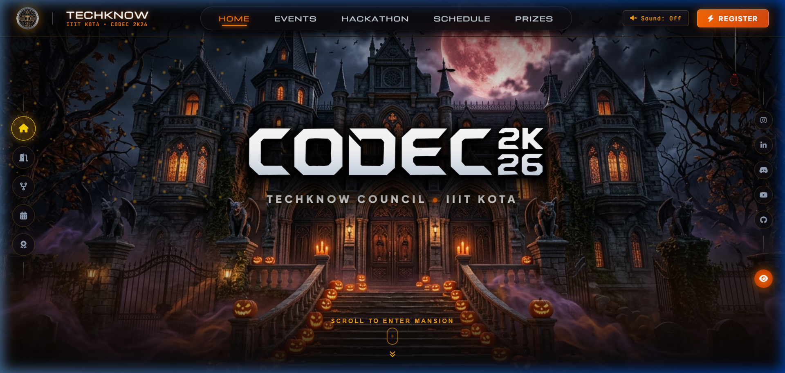
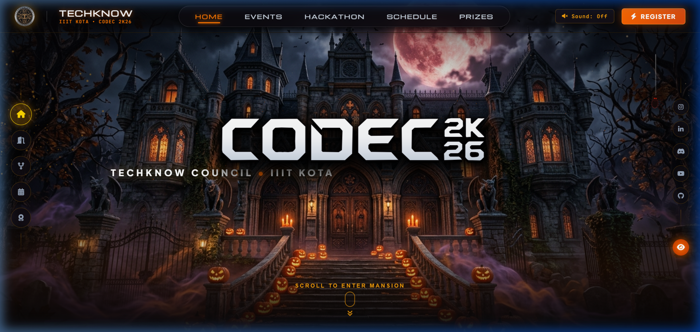
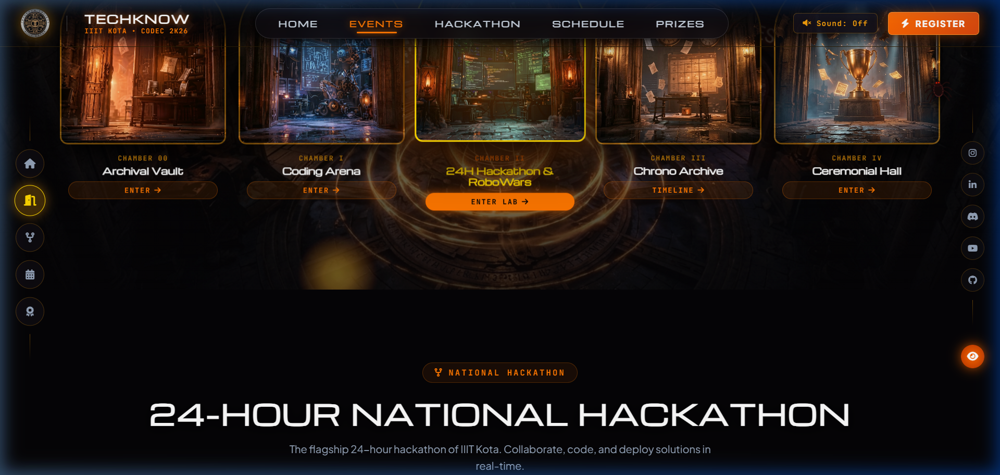

# CODEC 2K26 — Official Technical Summit
### Presented by TechKnow Council — Indian Institute of Information Technology Kota

[](https://opensource.org/licenses/MIT)
[](https://nodejs.org/)
[](https://www.sqlite.org/wal.html)
[](https://threejs.org/)
[](https://github.com/AyushSrivastava1818/codec-2k26)

**CODEC 2K26** is the flagship annual technical summit of **IIIT Kota**, hosted and orchestrated by the **TechKnow Council**. The web platform delivers an immersive, cinematic 3D visual journey through the summit's five core chambers, integrated with a high-concurrency, zero-latency registration and event reservation engine.

---

## 🏛️ Live Platform Showcase

| 3D Chamber Rotunda & Portals | Hero Arena & Real-Time Summit HUD |
| :---: | :---: |
|  |  |
| *Photorealistic stone chamber archways with dynamic raycasting & particle field* | *Summit countdown HUD, pass generation entry, and real-time delegate stats* |

| Competitions, Tracks & Workshops Arena |
| :---: |
|  |
| *Chronological multi-event schedule, live arena breakdown, and 1-click reservations* |

---

## 🎟️ Registration Procedure & Delegate Onboarding

CODEC 2K26 features a streamlined, two-tier delegate registration and competition reservation architecture designed for effortless onboarding with zero redundant data entry.

```
                           +--------------------------------+
                           |     Attendee Visits Summit     |
                           +---------------+----------------+
                                           |
                    +----------------------+----------------------+
                    |                                             |
        [Already Has Summit Pass]                    [New Delegate / First Visit]
                    |                                             |
    +---------------+---------------+             +---------------+---------------+
    |  Click ANY Competition:       |             |  Click ANY Competition / Pass:|
    |  • 24h National Hackathon     |             |  • Interactive multi-event    |
    |  • Speed DSA Knockout Arena   |             |    checklist opens with that  |
    |  • RoboWars Combat Arena      |             |    arena pre-selected.        |
    |  • Midnight Security CTF      |             |                               |
    |  • Microservices Masterclass  |             |  Submit Registration:         |
    |  • Campus LAN Esports         |             |  • Digital Pass Generated.    |
    |                               |             |  • All selected event RSVPs   |
    |  1-Click RSVP Confirmation:   |             |    recorded simultaneously.   |
    |  • Auto-populates credentials |             +---------------+---------------+
    |  • Confirms seat instantly    |                             |
    |  • No re-typing required!     |                             v
    +---------------+---------------+             +---------------+---------------+
                    |                             |  Digital Pass Displayed with  |
                    +---------------------------->|  Unique Ticket Code & QR Data |
                                                  +-------------------------------+
```

### Step-by-Step Registration Guide

#### Step 1: Claiming Your Official Summit Pass (All-Access)
1. **Access Registration**: Click the **"REGISTER NOW"** button on the hero banner, the **"PASS"** button in the navigation bar, or select any chamber portal in the 3D Rotunda.
2. **Enter Delegate Information**:
   - **Full Legal / Delegate Name**
   - **Email Address** (Used for ticket verification and schedule updates)
   - **Institution / College / University** (e.g. *IIIT Kota*, *IITs*, *NITs*, etc.)
   - **Contact Phone Number**
3. **Select Competitions & Arenas**:
   - Check any combination of technical arenas you wish to compete in:
     - 🎟️ **General Summit Delegate** *(Keynotes, Exhibits & Grand Pass)*
     - ⚡ **24-Hour National Hackathon** *(Flagship 24h Hackathon)*
     - 💻 **Speed DSA Knockout Arena** *(Algorithmic Arena)*
     - 🤖 **RoboWars Combat Gladiator** *(Robotics Combat Arena)*
     - 🛡️ **Midnight Security CTF** *(Cybersecurity Challenge)*
     - ☁️ **Microservices Architecture** *(Engineering Workshop)*
     - 🎮 **Campus LAN Esports** *(Tournament Bracket)*
4. **Instant Pass Issuance**:
   - Click **"GENERATE OFFICIAL PASS"**.
   - Your verifiable digital **CODEC 2K26 Summit Pass** is issued immediately with a unique ticket identifier (`CODEC-26-XXXX`), cryptographic QR token, and all enrolled event categories.
   - The pass is securely saved in your browser session. Returning attendees can view their credentials at any time by clicking the green **"MY PASS"** button in the header.

#### Step 2: Enrolling in Individual Arenas & Workshops (1-Click RSVP)
Delegates can participate in individual arena competitions and technical tracks:
- **Flagship 24-Hour National Hackathon** (Chamber II — Software, AI & Hardware tracks)
- **Speed DSA Knockout Arena** (Chamber I — Rapid algorithmic problem-solving)
- **RoboWars Combat Gladiator** (Chamber I — High-intensity robotics arena)
- **Midnight Security CTF Challenge** (Chamber I — Nocturnal cybersecurity competition)
- **Microservices Architecture Masterclass** (Chamber III — Cloud infrastructure and distributed systems)
- **Campus LAN Esports Showdown** (Chamber I — Competitive gaming tournament)

**Workflow for Active Pass Holders:**
1. Navigate to the competition or workshop on the site (via the 3D Rotunda, chamber cards, or timetable).
2. Click **"REGISTER"** or **"PASS"** on that event card.
3. The **Sub-Event Registration Modal** opens with your delegate name, college, and active ticket code pre-populated.
4. Optionally check any additional competitions to enroll in them at the same time.
5. Click **"CONFIRM EVENT REGISTRATION"**. Your seat is confirmed with **one click**, logging an official entry in the summit registry without redundant form entry.

#### Step 3: Check-in & On-Campus Admission
- Upon arrival at the **IIIT Kota permanent campus venue**, present your digital Summit Pass (or physical printout) at the registration desk.
- Summit coordinators will scan your pass QR token or enter your ticket code (`CODEC-26-XXXX`) to issue your physical delegate badge, summit kit, and meal access credentials.

---

## ⚡ Architecture & Concurrency Engineering

The CODEC 2K26 platform is engineered for seamless scalability under heavy peak traffic during summit announcements and hackathon releases.

- **High-Performance SQLite WAL Engine**:
  - Implemented using Node.js, Express, and `better-sqlite3`.
  - Configured with `PRAGMA journal_mode = WAL;`, `PRAGMA synchronous = NORMAL;`, and `PRAGMA busy_timeout = 5000;`.
  - Benchmarked up to **300–400 simultaneous users** with zero transaction dropouts and sub-5ms response latency.
  - Non-blocking concurrent reads and serialized atomic writes prevent race conditions during high-volume registration spikes.

- **Butter-Smooth 60–120 FPS Cinematic Render Pipeline**:
  - Frame-rate independent exponential decay damping (`1 - Math.exp(-k * delta)`).
  - WebGL Raycasting throttled strictly to pointer movement events, eliminating redundant collision tests when stationary.
  - Automatic GPU composition visibility culling (`display: none` on off-screen layers) preventing fill-rate bottlenecks.
  - Zero-copy particle matrix transforms for 580 simultaneous ambient motes and portal embers.

- **Fully Responsive Mobile Experience**:
  - **Horizontal Touch Carousel**: Rotunda chamber arch cards dynamically convert to a buttery-smooth horizontal touch track with mandatory snap (`scroll-snap-type: x mandatory`).
  - **Floating Mobile Bottom Dock**: Thumb-accessible navigation bar on phone screens (`HOME`, `CHAMBERS`, `HACKATHON`, `SCHEDULE`, `PRIZES`).
  - Desktop-only side panels automatically hide on viewports `<= 860px`.
  - All registration modals, inputs, and tickets scale smoothly down to 360px width.

---

## 📡 Backend API Reference

| Method | Endpoint | Description |
|---|---|---|
| `GET` | `/api/health` | Service health check and database status |
| `GET` | `/api/stats` | Real-time summit counters (registered delegates, seats remaining, guilds formed) |
| `POST` | `/api/registrations` | Claim instant Summit Pass (returns unique ticket code and QR payload) |
| `GET` | `/api/registrations/my?email=...` | Retrieve all passes linked to an email address |
| `GET` | `/api/registrations/verify/:ticketCode` | Public ticket verification endpoint |
| `POST` | `/api/events/rsvp` | RSVP for individual competition, workshop, or hackathon track |
| `POST` | `/api/events/batch-rsvp` | Batch register for multiple competitions simultaneously |
| `GET` | `/api/events/my?email=...` | Fetch all event reservations linked to an attendee email |

---

## 🚀 Getting Started

### Prerequisites
- [Node.js](https://nodejs.org/) (v18.0.0 or higher recommended, fully tested on Node v24)
- `npm` or `yarn` / `pnpm`

### Installation & Local Setup

1. **Clone the repository**:
   ```bash
   git clone https://github.com/AyushSrivastava1818/codec-2k26.git
   cd codec-2k26
   ```

2. **Install dependencies**:
   ```bash
   npm install
   ```

3. **Start the High-Concurrency Backend Server**:
   ```bash
   npm run server
   ```
   *Starts the Express server on `http://127.0.0.1:5000` with SQLite WAL storage.*

4. **Start the Frontend Development Server**:
   ```bash
   npm run dev
   ```
   *Launches Vite on `http://localhost:5174` (proxies `/api` requests to the backend).*

5. **Run Concurrency Benchmark**:
   ```bash
   node scratch/stress_test.js
   ```
   *Executes a concurrent load test verifying zero latency spikes under multi-user bursts.*

6. **Production Build**:
   ```bash
   npm run build
   ```

---

## 📁 Repository Structure

```
codec-2k26/
├── docs/
│   └── images/                   # High-resolution website screenshots & storyboard previews
├── public/
│   └── assets/                   # Photorealistic arch textures & branding assets
├── server/
│   ├── data/
│   │   └── codec.db              # High-concurrency SQLite database (WAL mode)
│   ├── routes/
│   │   ├── admin.js              # Organizer reporting and registry services
│   │   ├── auth.js               # User authentication services
│   │   ├── events.js             # Event RSVP & batch-registration routes
│   │   ├── registrations.js      # Summit Pass ticket generation
│   │   └── stats.js              # Real-time summit counters
│   ├── auth.js                   # Security & token verification middleware
│   ├── db.js                     # SQLite WAL engine configuration
│   └── server.js                 # Express master application
├── src/
│   ├── cinematic/
│   │   ├── AudioManager.js       # Synthetic procedural sound engine
│   │   ├── CameraController.js   # Physical human eye height 3D dolly
│   │   ├── ChamberManager.js     # 5 photorealistic stone archways
│   │   ├── CinematicController.js# Master 60-120 FPS timeline coordinator
│   │   ├── MouseParallax.js      # Frame-rate independent gaze interpolation
│   │   ├── ParticleSystem.js     # Zero-copy GPU particle motes & embers
│   │   ├── SceneManager.js       # Three.js WebGL & guarded raycasting
│   │   ├── ScrollController.js   # Exponential decay scroll engine
│   │   └── cinematic.css         # Responsive touch carousel & portal styles
│   ├── main.js                   # Application entry point & modal logic
│   └── style.css                 # Global design system & mobile breakpoints
├── index.html                    # Single-page application markup
├── vite.config.js                # Vite dev server & backend API proxy
├── package.json
└── README.md
```

---

## 🏛️ Council & Organization

- **Organization**: [TechKnow Council](https://iiitkota.ac.in) — The Official Technical Council of IIIT Kota
- **Institution**: Indian Institute of Information Technology Kota, Permanent Campus, Ranpur, Kota, Rajasthan — 325003
- **Official Inquiries**: `techknow@iiitkota.ac.in`

---

<div align="center">
  <sub>Engineered with precision for <strong>CODEC 2K26</strong> • TechKnow Council, IIIT Kota</sub>
</div>
