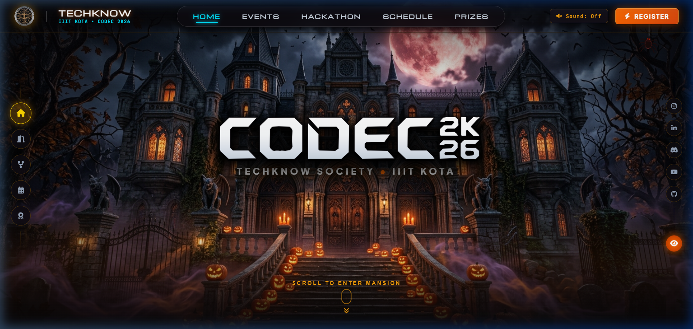
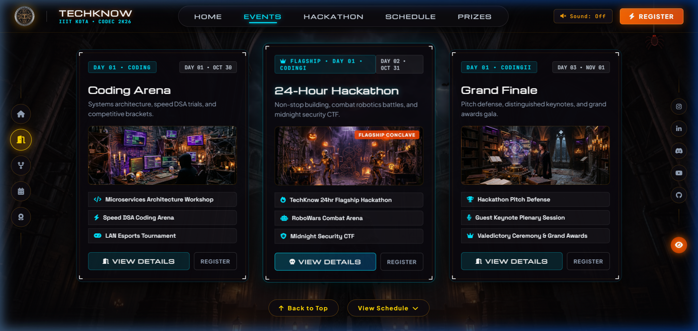
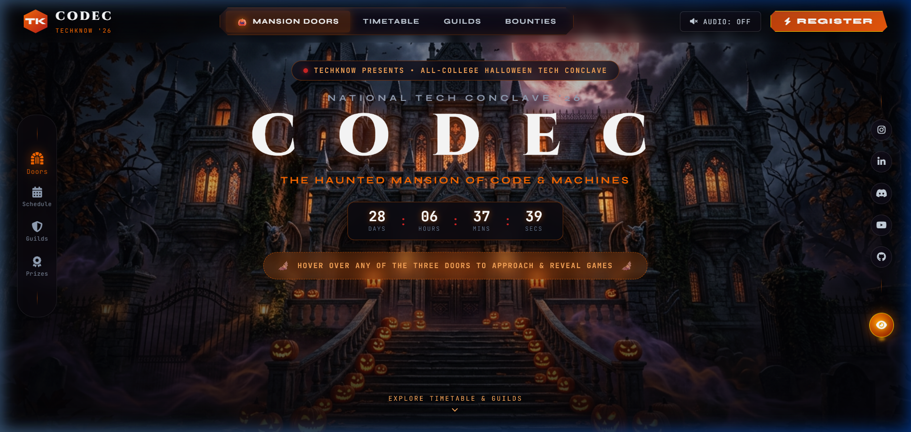
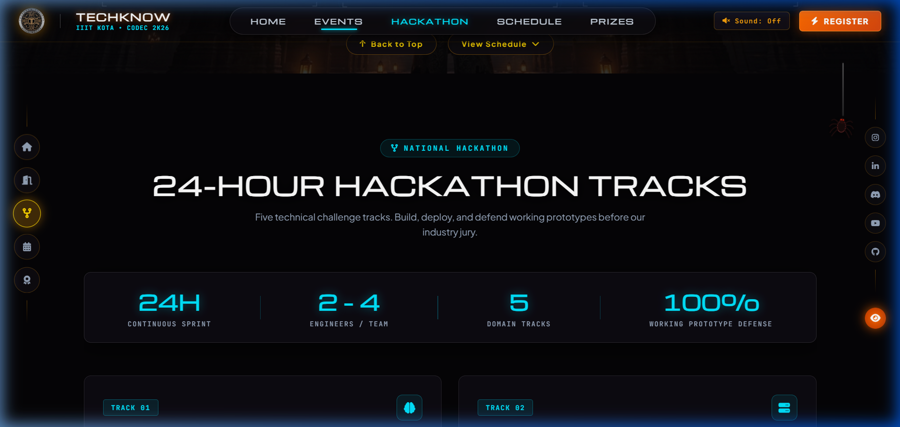
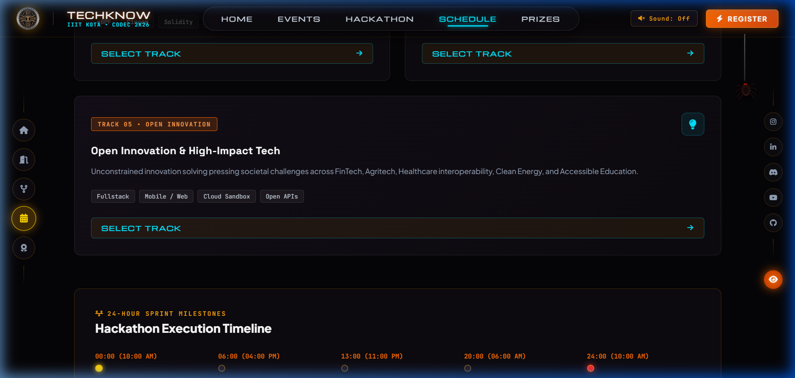
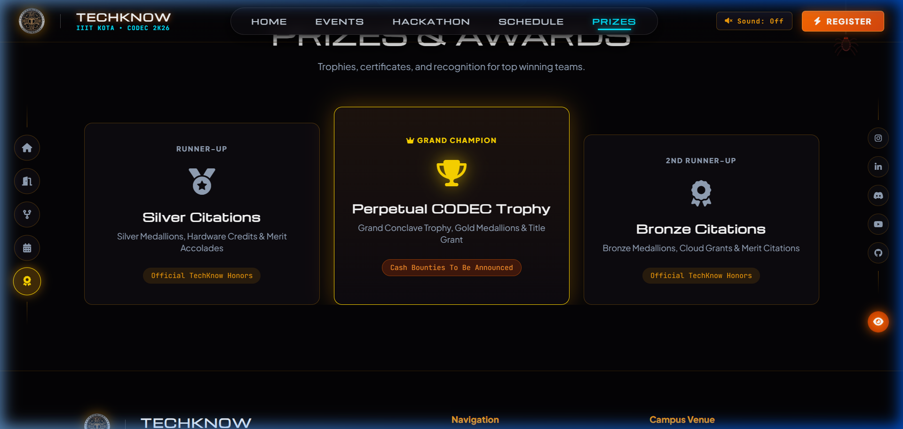

# CODEC 2K26 — Flagship Technical Conclave & National Hackathon

<div align="center">


### **TechKnow Society • Technical Council • Indian Institute of Information Technology Kota**

[](https://vitejs.dev/)
[](https://developer.mozilla.org/en-US/docs/Web/JavaScript)
[](https://developer.mozilla.org/en-US/docs/Web/CSS)
[](https://developer.mozilla.org/en-US/docs/Web/API/Web_Audio_API)
[](https://github.com/AyushSrivastava1818/codec-2k26)

*“WE ARE THE ‘ T ’ OF IIIT KOTA”*

</div>

---

## 🏛️ Overview

**CODEC 2K26** is the annual flagship technical conclave organized by **TechKnow Society**, the official Technical Council of **IIIT Kota**. This cutting-edge web portal delivers an immersive, Halloween-themed cinematic journey seamlessly fused with a high-tech engineering aesthetic.

The application blends 3D perspective scroll animations, volumetric fog transitions, an atmospheric rotunda with interactive event chambers, real-time scroll navigation, and a modern registration engine — running smoothly at a rock-solid **120 FPS**.

---

## 📸 Visual Showcase

### 1. Exterior Haunted Mansion & Hero Stage
> Cinematic scale zoom into the haunted mansion with titanium-faceted typography, atmospheric vignette, and HUD capsule navigation.



---

### 2. Rotunda & The 3 Chamber Portals
> Passing through volumetric mist, the user enters the interior rotunda where a hooded warrior stands guard before the three event chambers: **Coding Arena (Oct 30)**, **24H Hackathon & RoboWars (Oct 31)**, and **Grand Finale (Nov 01)**.



---

### 3. Fullscreen Immersive Chamber Modal
> Clicking any chamber card opens an immersive fullscreen environment featuring high-resolution chamber interiors, event schedules, and team registration shortcuts.



---

### 4. 24-Hour National Hackathon Hub
> The flagship hackathon portal featuring a 4-stat key specs bar (`24H Continuous Sprint`, `2 - 4 Members / Team`, `₹1,00,000+ Prize Pool`, `Open to All Colleges`) and direct team registration.



---

### 5. Official 3-Day Conclave Timetable
> Day-by-day interactive timetable streaming workshops, competitive coding rounds, combat robotics, midnight CTF, and project pitch defense.



---

### 6. Honors & Recognition Podium
> Grand Champion perpetual trophy citation, 1st Runner-Up, and 2nd Runner-Up awards.



---

## ✨ Key Architectural Features

- **🎮 120 FPS Cinematic Zoom Scroll Engine**:
  Uses requestAnimationFrame interpolation and hardware-composited `transform: translate3d()` and `scale()` properties to eliminate layout thrashing and jitter.

- **🧭 Real-Time Dynamic ScrollSpy**:
  Accurately tracks user position using `getBoundingClientRect()` thresholds, highlighting the active section (`HOME`, `EVENTS`, `HACKATHON`, `SCHEDULE`, `PRIZES`) across both the top HUD capsule and the left floating dock.

- **🎃 Halloween Fiery Orange Aesthetic**:
  Styled with glowing pumpkin orange (`#ff7700` / `#ff6a00`) accents, dark glassmorphism (`rgba(14, 11, 18, 0.92)`), and clean, modern fonts:
  - **Headings & Badges**: `Syncopate` & `Michroma`
  - **Subtitles & Card Titles**: `Space Grotesk`
  - **Body Copy**: `Plus Jakarta Sans`
  - **Timestamps & Codes**: `JetBrains Mono`

- **🔊 Web Audio API Atmospheric Soundscape**:
  Built-in synthetic haunted ambiance generator with organic oscillators and biquad filters — zero external MP3 dependencies, instant playback with user toggle.

- **⚡ Procedural Lightning & Interactive Spider**:
  Dynamic canvas/CSS flash intervals simulating nocturnal lightning strikes and an interactive corner spider with playful web physics.

- **📱 Fully Responsive**:
  Adaptive layout scaling seamlessly from 4K ultra-wide monitors down to modern mobile smartphones.

---

## 🛠️ Technology Stack

| Layer | Technology |
|---|---|
| **Build Tool** | [Vite](https://vitejs.dev/) |
| **Core Architecture** | Vanilla HTML5 & ES6+ JavaScript |
| **Styling** | Vanilla CSS3 (Custom Glassmorphism, CSS Variables, Composited GPU Transforms) |
| **Audio** | HTML5 Web Audio API (Synthesized oscillators) |
| **Icons & Fonts** | FontAwesome 6 Pro, Google Fonts (`Syncopate`, `Michroma`, `Space Grotesk`, `Plus Jakarta Sans`, `JetBrains Mono`) |

---

## 🚀 Getting Started

### Prerequisites
- [Node.js](https://nodejs.org/) (v18.0.0 or higher recommended)
- `npm` or `yarn` / `pnpm`

### Installation

1. **Clone the repository**:
   ```bash
   git clone https://github.com/AyushSrivastava1818/codec-2k26.git
   cd codec-2k26
   ```

2. **Install dependencies**:
   ```bash
   npm install
   ```

3. **Start local development server**:
   ```bash
   npm run dev
   ```
   Open `http://localhost:5173` in your browser.

4. **Build production bundle**:
   ```bash
   npm run build
   ```
   The optimized production bundle will be generated in `dist/`.

---

## 📁 Repository Structure

```
codec-2k26/
├── docs/
│   └── screenshots/              # High-resolution screenshots of all sections
│       ├── 01_hero_mansion.png
│       ├── 02_events_chambers.png
│       ├── 03_chamber_interior_modal.png
│       ├── 04_national_hackathon.png
│       ├── 05_schedule_timetable.png
│       └── 06_prizes_honors.png
├── public/
│   ├── assets/                   # Vector logos, backgrounds & chamber assets
│   ├── favicon.svg
│   └── icons.svg
├── src/
│   ├── counter.js
│   ├── main.js                   # Scroll engine, audio synthesizer, ScrollSpy router
│   └── style.css                 # Master design system & Halloween orange tokens
├── index.html                    # Single-page application markup
├── package.json
└── README.md
```

---

## 🏛️ Council & Organization

- **Organization**: [TechKnow Society](https://iiitkota.ac.in) — The Technical Council of IIIT Kota
- **Institution**: Indian Institute of Information Technology Kota (IIIT Kota), Rajasthan, India
- **Contact**: `techknow@iiitkota.ac.in`

---

<div align="center">
  <sub>Engineered with precision for <strong>CODEC 2K26</strong> • TechKnow Society, IIIT Kota</sub>
</div>
